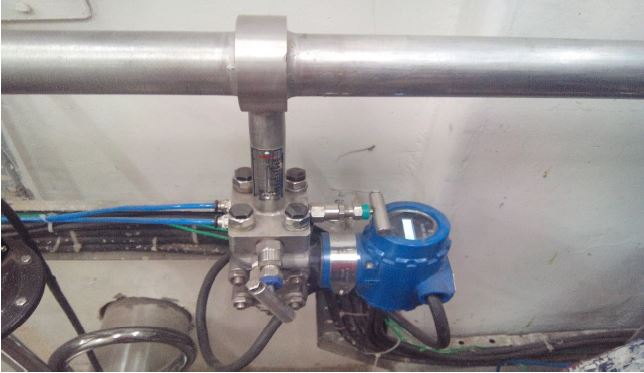
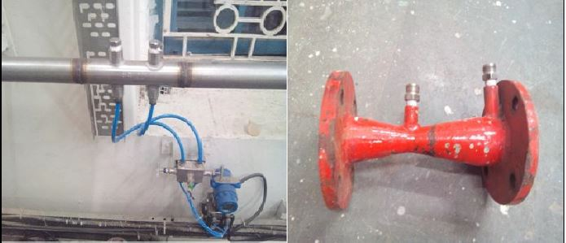
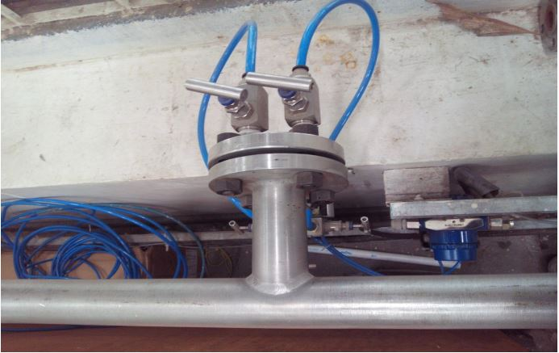
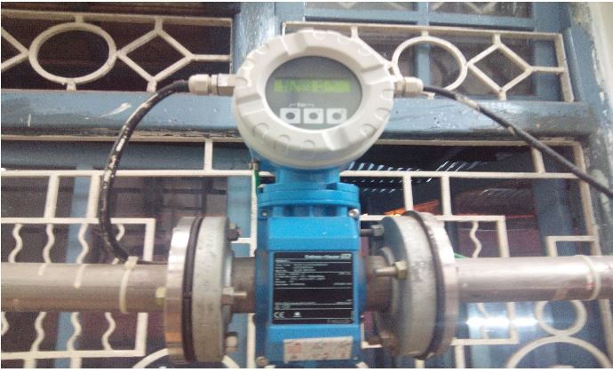
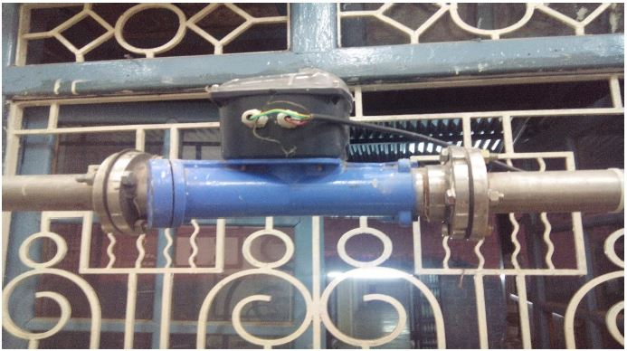
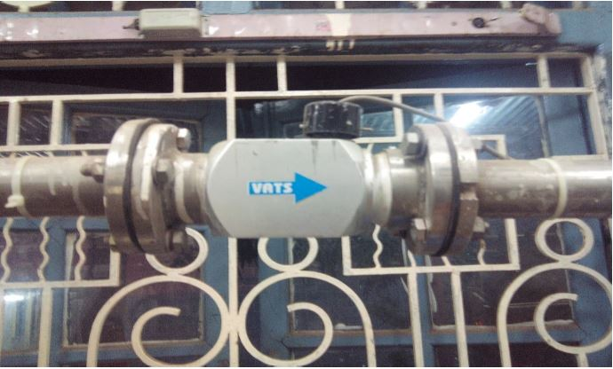
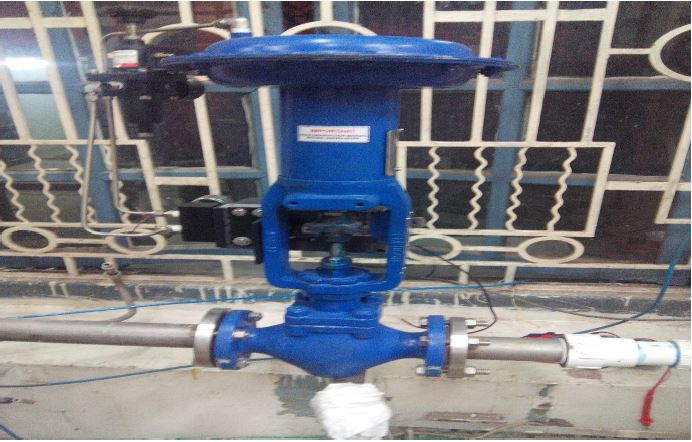
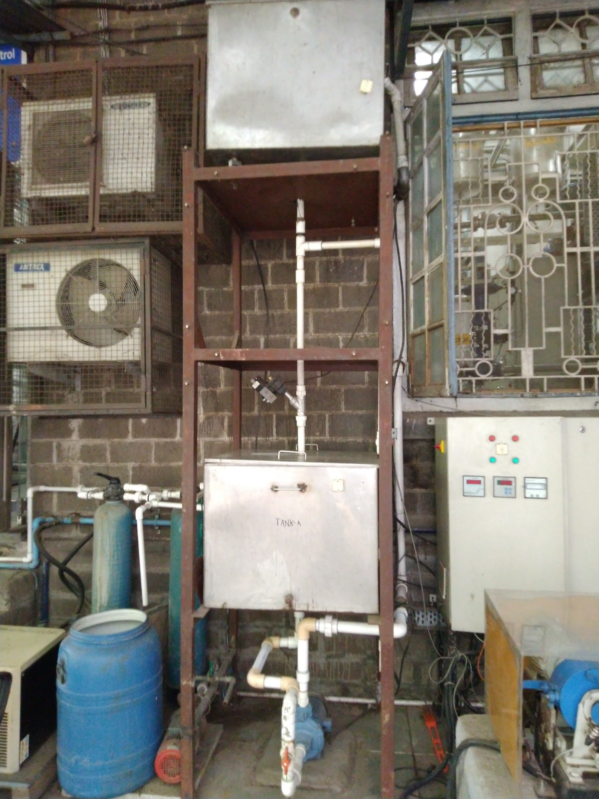

##### 1.	Orifice Flow Meter

Orifice meter is type of variable head meter. In this meter the obstruction to the flow consist of an engineering constriction in the metered fluid which causes a reduction in the flow pressure. An orifice plate is a conduit and a restriction to create a pressure drop. It uses the same principle as a Venturi tube namely Bernoulli's principle which states that there is a relationship between the pressure of the fluid and the velocity of the fluid. When the velocity increases, the pressure decreases and vice versa.

##### 2.	Venturi Flow Meter

Venturi tube is a device used for measuring the rate of flow of a fluid through a pipe. The basic principle on which a venturi tube works is that by reducing the cross sectional area of the flow of passage, a pressure difference is created and the measurement of the pressure difference enables the determination of the discharge through a pipe.

##### 3.	Pitot Flow Meter

The basic pitot tube consists of a tube pointing directly into the fluid flow. As this tube contains fluid, a pressure can be measured; the moving fluid is brought to rest (stagnates) as there is no outlet to allow flow to continue. This pressure is the stagnation pressure of the fluid, also known as the total pressure or (particularly in aviation) the pitot pressure.

##### 4.	Magnetic Flow Meter

The principle of operation for the magnetic flowmeter is based on the Faraday’s Law of Electromagnetic Induction. An electrical current (I) is applied to a coil package inside the flowmeter. As a result, a magnetic field (B) is created across the metering pipe.

##### 5.	Ultrasonic Flow Meter

The transit-time ultrasonic flow meter utilizes the propagation time of the ultrasonic signal in the fluid. A pair of transducers are installed on the outer surface of the pipe as shown in the diagram. Each transducer works alternatively as both transmitter and receiver of ultrasonic signals.

##### 6.	Turbine Flow Meter

Turbine Flow Meter is a volumetric measuring turbine type. The flowing fluid engages the rotor causing it to rotate at an angular velocity proportional to the fluid flow rate.
The angular velocity of the rotor results in the generation of an electrical signal (AC sine wave type) in the pickup. The summation of the pulsing electrical signal is related directly to total flow.
The frequency of the signal relates directly to the flow rate. The vaned rotor is the only moving part of the flow meter.

##### 7.	Control Valve

##### 8.	Flow Sensor Plant
 

